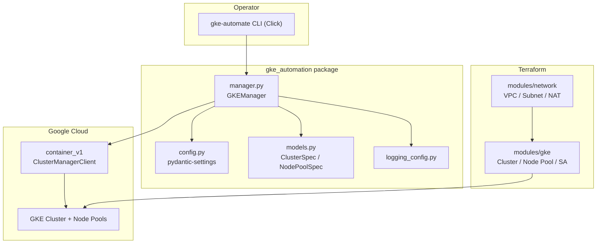

# gke-automation

Typed Python automation toolkit and CLI for the lifecycle of
**Google Kubernetes Engine (GKE)** clusters, paired with production-shaped
Terraform infrastructure.

[](LICENSE)
[](https://github.com/abhisheksawant52/gke-automation/actions/workflows/ci.yml)
[](https://www.python.org/)
[](https://www.terraform.io/)

## Overview

`gke-automation` gives platform teams two complementary paths to manage GKE:

- A small, strongly typed **Python package** that wraps the
  `google-cloud-container` API (`ClusterManagerClient`) with clear, documented
  methods for creating, describing, resizing, upgrading, and deleting clusters
  and node pools, plus rendering a `kubeconfig` for a running cluster.
- A **Terraform** root module (with reusable `network` and `gke` sub-modules
  and `dev`/`prod` environments) that provisions the underlying VPC, subnetwork,
  service accounts, and a workload-identity-enabled cluster.

The Python side is intended for day-2 operations and scripted workflows; the
Terraform side is intended for declarative provisioning. Configuration is
centralised through environment variables (`GKE_*`) so the same settings drive
the CLI in local, CI, and automation contexts.

This is a scaffold: it is coherent, type-checked, and buildable, but it does not
attempt to make live Google Cloud calls succeed without real credentials.

## Architecture



Components:

- **CLI (`gke-automate`)** — Click entrypoint exposing subcommands.
- **`GKEManager`** — typed wrapper over `container_v1.ClusterManagerClient`.
- **`Settings`** — `pydantic-settings` model reading `GKE_*` variables.
- **Terraform modules** — `network` (VPC, subnet with secondary ranges, Cloud
  NAT) and `gke` (cluster, autoscaling node pool, node service account).

## Features

- Cluster lifecycle: create, get, list, delete, and control-plane upgrade.
- Node-pool management: create autoscaling pools, resize, and update
  autoscaling bounds.
- Kubeconfig rendering using the `gke-gcloud-auth-plugin` exec auth provider.
- Validated configuration (release channels, autoscaling bounds) via Pydantic.
- Terraform IaC with VPC-native networking, Workload Identity, auto-repair and
  auto-upgrade node management, and separate `dev`/`prod` environments.
- Full open-source hygiene: CI, pre-commit, dependabot, issue/PR templates.

## Tech Stack

- Python 3.11 / 3.12, `google-cloud-container`, `google-auth`,
  `pydantic-settings`, `click`.
- Terraform >= 1.5 with the `hashicorp/google` provider (~> 5.30).
- Tooling: ruff, black, pytest, pre-commit, GitHub Actions.

## Getting Started

### Prerequisites

- Python 3.11+
- Terraform >= 1.5 (for the infrastructure)
- A Google Cloud project and credentials (Application Default Credentials or a
  service-account key)

### Install

```bash
make install          # editable install with dev extras
cp .env.example .env  # then edit values
```

### Configure

Set the `GKE_*` variables (see [Configuration](#configuration)). At minimum,
`GKE_PROJECT_ID` and `GKE_LOCATION` should point at your project.

### Run the CLI

```bash
gke-automate --help
gke-automate list
gke-automate create --name primary --node-count 3
gke-automate describe --name primary
gke-automate resize --node-pool primary-pool --node-count 5
gke-automate upgrade --version 1.29.5-gke.1091002
gke-automate kubeconfig --name primary -o kubeconfig
gke-automate delete --name primary
```

### Provision infrastructure

```bash
cd terraform
terraform init -backend-config=environments/dev/backend.hcl
terraform plan  -var-file=environments/dev/terraform.tfvars
terraform apply -var-file=environments/dev/terraform.tfvars
```

## Project Structure

```text
gke-automation/
├── src/gke_automation/
│   ├── __init__.py
│   ├── config.py            # pydantic-settings configuration
│   ├── logging_config.py    # logging setup
│   ├── exceptions.py        # error hierarchy
│   ├── models.py            # ClusterSpec / NodePoolSpec
│   ├── manager.py           # GKEManager (container_v1 wrapper)
│   └── cli.py               # Click CLI (gke-automate)
├── tests/                   # pytest unit tests
├── terraform/
│   ├── versions.tf          # required_providers + gcs backend
│   ├── providers.tf
│   ├── main.tf              # wires network + gke modules
│   ├── variables.tf
│   ├── outputs.tf
│   ├── terraform.tfvars.example
│   ├── modules/
│   │   ├── network/        # VPC, subnet, Cloud NAT
│   │   └── gke/            # cluster, node pool, service account
│   └── environments/
│       ├── dev/            # tfvars + backend.hcl
│       └── prod/
├── Dockerfile               # slim image packaging the CLI
├── Makefile
├── pyproject.toml
└── requirements.txt
```

## Configuration

All settings are read from environment variables prefixed with `GKE_`
(see `.env.example`).

| Variable               | Default              | Description                                   |
| ---------------------- | -------------------- | --------------------------------------------- |
| `GKE_PROJECT_ID`       | `my-gcp-project`     | GCP project that owns the cluster             |
| `GKE_LOCATION`         | `europe-west1`       | Region or zone for the cluster                |
| `GKE_ZONE`             | `europe-west1-b`     | Compute zone for zonal placement              |
| `GKE_CLUSTER_NAME`     | `primary`            | Default cluster targeted by the CLI           |
| `GKE_NODE_COUNT`       | `3`                  | Initial node count per pool                   |
| `GKE_MACHINE_TYPE`     | `e2-standard-4`      | Compute Engine machine type                   |
| `GKE_MIN_NODES`        | `1`                  | Autoscaling minimum                           |
| `GKE_MAX_NODES`        | `5`                  | Autoscaling maximum                           |
| `GKE_RELEASE_CHANNEL`  | `REGULAR`            | `RAPID` / `REGULAR` / `STABLE` / `UNSPECIFIED`|
| `GKE_CREDENTIALS_FILE` | _(unset)_            | Optional service-account key path             |
| `GKE_LOG_LEVEL`        | `INFO`               | Root log level                                |

## Deployment

The `terraform/` directory holds the infrastructure. Each environment under
`terraform/environments/` provides a `terraform.tfvars` and a `backend.hcl` for
the GCS remote state backend (the backend block in `versions.tf` is commented
out; supply it via `-backend-config` at `init`). The `docker` Make target builds
a slim image that packages the `gke-automate` CLI for use in CI or automation
runners:

```bash
make docker
docker run --rm gke-automation:0.1.0 --help
```

## Contributing

Contributions are welcome. Please read [CONTRIBUTING.md](CONTRIBUTING.md) and our
[Code of Conduct](CODE_OF_CONDUCT.md).

## Security

Please report vulnerabilities as described in [SECURITY.md](SECURITY.md).

## License

Released under the [MIT License](LICENSE).
